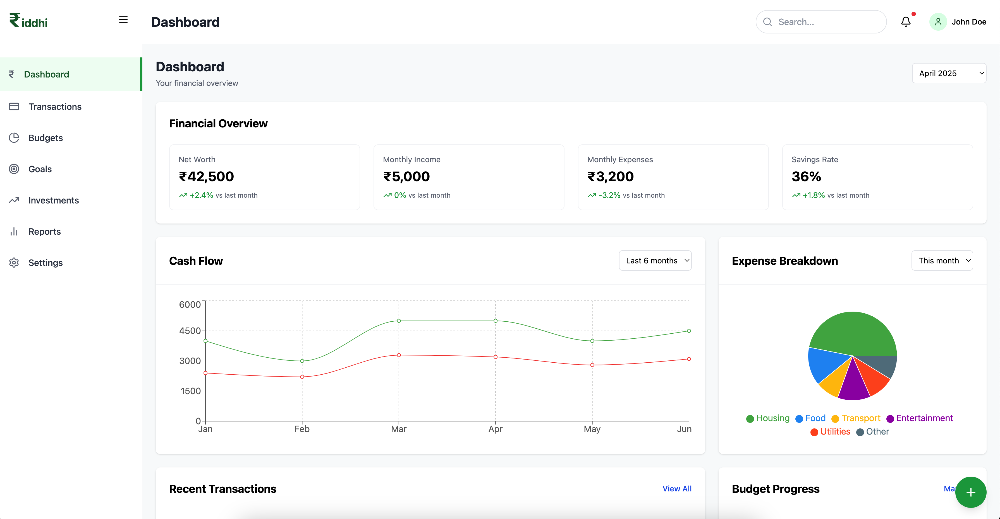

# ₹iddhi - Your Complete Personal Finance Solution

**Take control of your financial future with ₹iddhi - the all-in-one personal finance management tool**

## About ₹iddhi

₹iddhi helps you understand where your money goes, plan for your future, and achieve your financial goals. With an intuitive interface and powerful features, managing your finances has never been easier.

## Key Features

### 💰 Financial Dashboard

Get a complete overview of your finances at a glance:

- Net worth tracker
- Monthly cash flow visualization
- Spending breakdown charts
- Recent transaction activity
- Goal progress indicators

### 📊 Transaction Management

- Effortlessly track expenses and income
- Automatic categorization of transactions
- Connect your bank accounts for real-time updates
- Add receipt photos to keep records organized
- Search and filter transactions with ease

### 📝 Budget Planning

- Create customized monthly budgets
- Track spending against budget limits
- Get alerts when approaching budget limits
- View budget history to identify spending patterns
- Use budget templates for quick setup

### 🎯 Goal Tracking

- Set savings goals with target dates
- Track debt payoff progress
- Visualize your path to major purchases
- Monitor retirement savings
- Receive recommendations to reach goals faster

### 💼 Investment Portfolio

- Track all your investments in one place
- Visualize asset allocation
- Monitor investment performance
- Track dividends and returns
- See historical performance trends

### 📈 Reports & Insights

- Generate detailed spending reports
- Compare month-to-month finances
- Identify spending trends and patterns
- Export data for tax preparation
- Get personalized financial insights

### ⚙️ Customization

- Personalize your dashboard layout
- Choose your preferred currency and date format
- Select light or dark theme
- Set notification preferences
- Custom tags for transactions

## Why Choose ₹iddhi?

- **Security First**: Your financial data is protected with bank-level encryption
- **User-Friendly**: Intuitive interface designed for users of all experience levels
- **Cross-Platform**: Access your finances from any device
- **Privacy Focused**: Your data is never sold to third parties
- **Continuous Improvements**: Regular updates with new features

## Getting Started

1. Create your free account at [₹iddhi.app](https://₹iddhi.app)
2. Connect your accounts or start entering transactions manually
3. Set up your first budget and financial goals
4. Customize your dashboard to focus on what matters to you
# Riddhi
